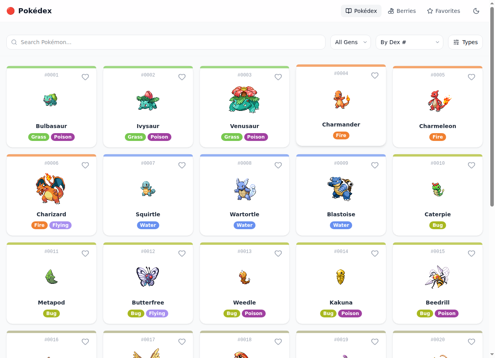
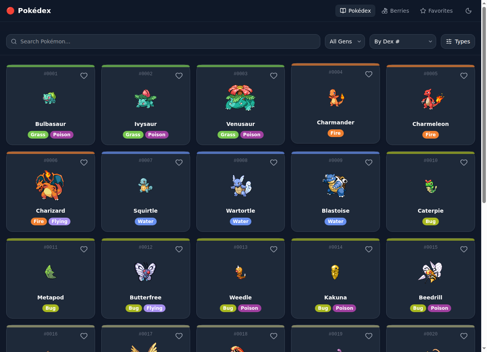
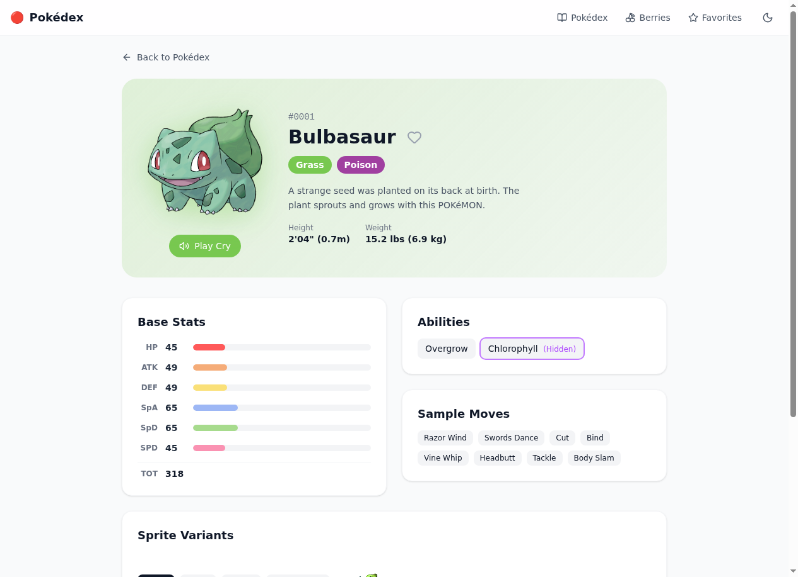
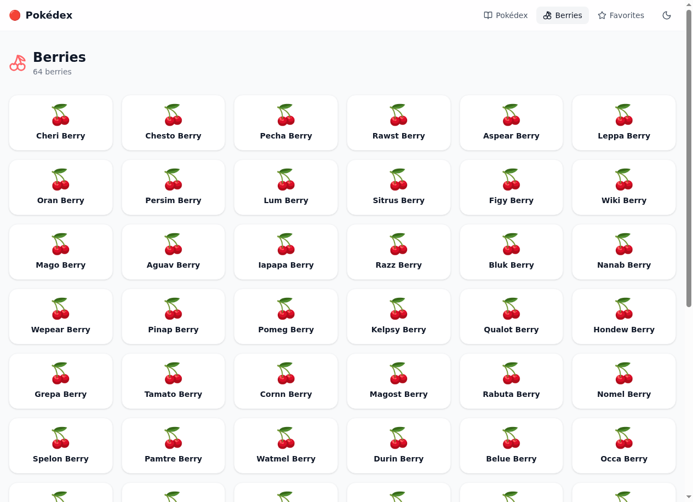

# Pokédex

[](https://github.com/AZagatti/pokedex-s46hi-opusadv/actions/workflows/deploy.yml)
[](LICENSE)

A full-featured Pokédex web app built with SvelteKit 5 runes, Tailwind CSS v4, and the PokéAPI.

**[Live Demo →](https://azagatti.github.io/pokedex-s46hi-opusadv/)**

---

## Screenshots

| Home (light) | Home (dark) |
|---|---|
|  |  |

| Pokémon Detail | Berries |
|---|---|
|  |  |

---

## Features

- **Infinite scroll** — browse all 1025+ Pokémon loaded in batches of 30
- **Search** — debounced 250ms search by name or Pokédex number
- **Generation filter** — filter by Gen 1–9, loads the full generation on selection
- **Type multi-select** — filter by one or more types, backfills from PokeAPI
- **Sort** — by Pokédex number or base-stat total
- **Pokémon detail** — official artwork, animated stat bars, abilities, moves, sprite switcher (4 variants), evolution chain, and cry button (Web Audio API)
- **Berries** — full berry list with flavor profile bars and growth stats
- **Favorites** — save/unsave Pokémon; persisted in `localStorage`
- **Dark/light theme** — toggled via button, persisted in `localStorage`, no flash on load
- **Fully accessible** — ARIA labels, keyboard navigation, `role="progressbar"` on stat bars

---

## Tech stack

| | |
|---|---|
| **Framework** | SvelteKit 2 + Svelte 5 runes |
| **Language** | TypeScript (strict) |
| **Styles** | Tailwind CSS v4 |
| **Adapter** | `@sveltejs/adapter-static` (SPA, `fallback: '404.html'`) |
| **Data** | Native `fetch` + Zod schemas + in-memory Map cache |
| **Linting** | oxlint + oxfmt (via ultracite) |
| **Hooks** | lefthook (pre-commit: lint/format/typecheck; pre-push: unit tests) |
| **Tests** | Vitest (unit) + Playwright (e2e) |
| **CI/CD** | GitHub Actions → GitHub Pages |

---

## Run locally

```bash
git clone https://github.com/AZagatti/pokedex-s46hi-opusadv.git
cd pokedex-s46hi-opusadv
npm install
npm run dev
```

Open [http://localhost:5173](http://localhost:5173).

```bash
# Type check
npm run check

# Lint
npm run lint

# Unit tests
npm run test:unit

# E2E tests (builds first)
npm run test:e2e

# Production build (with GitHub Pages base path)
BASE_PATH=/pokedex-s46hi-opusadv npm run build
```

---

## Architecture

See [docs/ARCHITECTURE.md](docs/ARCHITECTURE.md) for data flow, caching, and routing details.

See [docs/DECISIONS.md](docs/DECISIONS.md) for library and design decisions.
